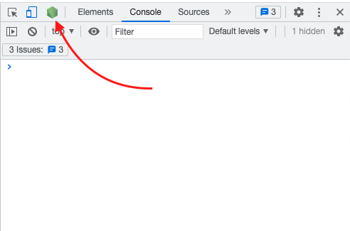
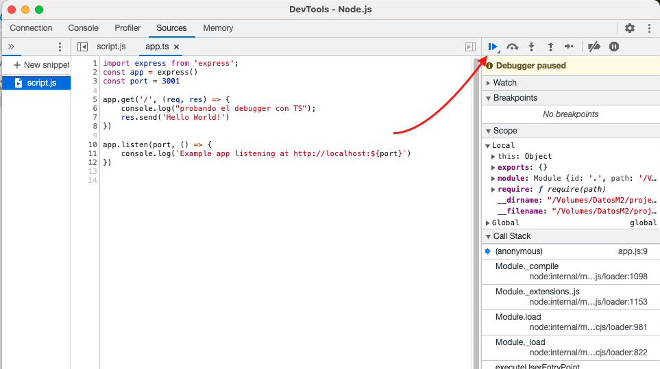

# Configuración de un proyecto de Node con TypeScript
- Debugger en chrome
- Parcel recompilando súper rápido
- Nodemon escuchando cambios
- Map de TS a JS

```bash
yarn install
```
```bash
yarn dev:watch
```

* como está el argumento '--inspect-brk', se esperará a que abramos el debugger de node en chrome:


* y luego start


allí puedes colocar todos los breackpoints

### Tutoriales en Youtube
  - [Parte 1 JS](https://youtu.be/JQK-QbcjlC0)
  - [Parte 2 TS](https://youtu.be/gsxG1BsDd2E)
